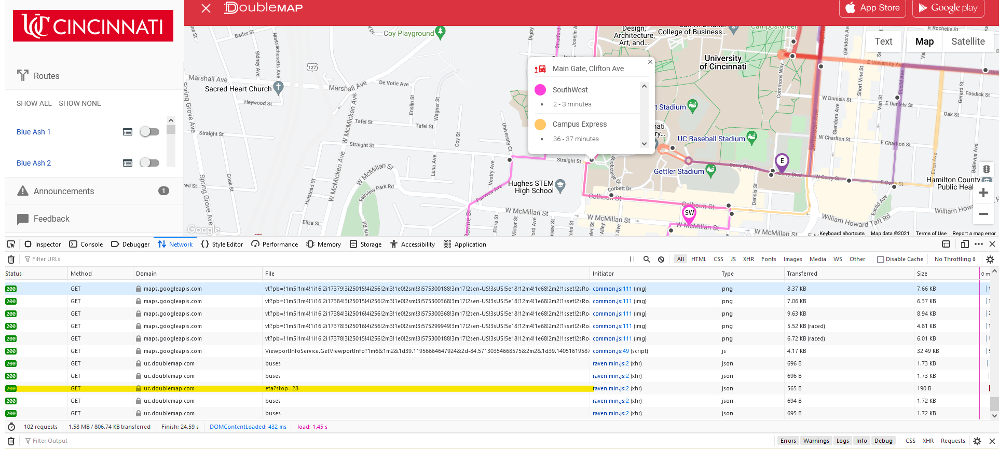
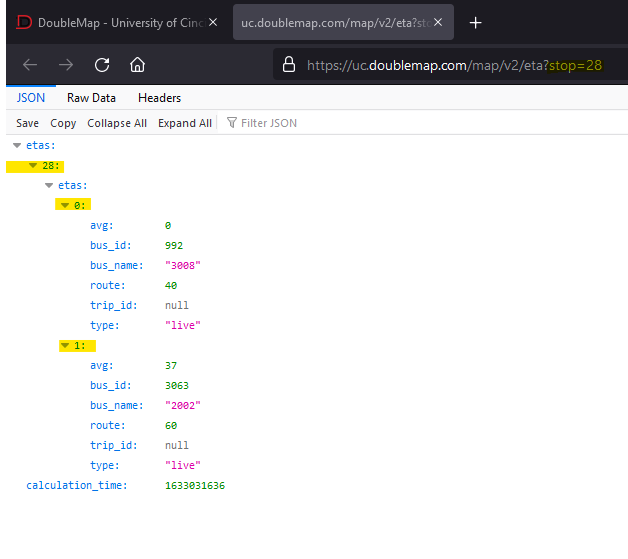
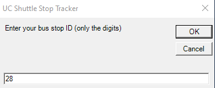

# Project 1

## What is this?
This is a powershell script that monitors the analyzes the UC shuttle stops and alerts you when its time to leave, 5 minutes before arrival, when the bus is one minute away, and when it is arriving.

This is a powershell script that analyzes the UC shuttle stops and alerts you when its time to leave, when the bus is five minutes away, one minute away, and arriving. It simply runs Invoke-Requests on the shuttlestops to grab the json data, and to look for the avg estimated time of arrival. It refreshes the data every 10 seconds. And when the if statement matches the one of the designated times, it runs a MessageBox to prompt you on the screen of the time.

## How do I use it?
First off, the program needs to know what shuttle stop you want to monitor. To do this navigate to [the University's shuttle map](https://uc.doublemap.com/map/), and turn on the route you want to use. Right click on either the header, or the right side panel, and select "inspect element". Or navigate to your browsers dev tools, and find that feature (F12 works for most browsers). Switch to the network tab to inspect file transfers, and click on your desired stop location to monitor. You should see a GET request made with the file `eta?stop=<yourStopID>`

Double click that link to view the physical json data, and take note of a couple of items that will be asked in the script. First item to note, is your stopID, you can find that in the link eta?(stop=x). Or, you also will see in as the second object in the json data.
  

Second item to take note of, is the json object position. If your shuttle stop location serves more than one route, you will see all busses that stop there. So you need to figure out which ETA matches the one shown on the map, and note the position it is. In this screenshot, there are two buses: bus 0 and bus 1. There is probably a better way to script this, but I couldn't figure it out.

  

After you have located the object position of the bus you want to track, as well as the stopID: download the `Alex_Mestemaker_Project1.ps1` file, and execute it.

As it executes, you will be prompted for the bus stop ID. For this example, I used 28. Type that into the window and press OK.
  

Enter the object position that is the bus you want to track. In most cases, its 0, if that is the only bus that uses that stop.

The third prompt is used to alert you when it's time to leave. So enter a value in minutes, that you want to be alerted prior to the bus arriving.

You should be instantly reminded how many minutes until the bus arrives. The script runs quietly in the powershell session, and checks the ETA every 10 seconds that you can view in the powershell terminal. When the minutes decrease to 5, 1, 0, or the user inputted value, a window will appear to remind you.

