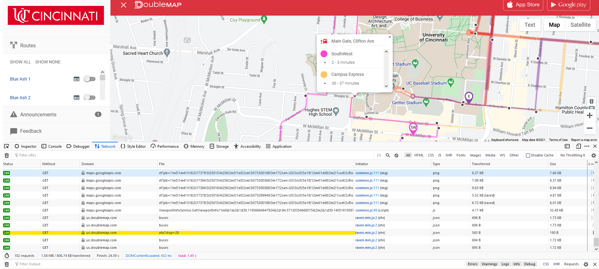
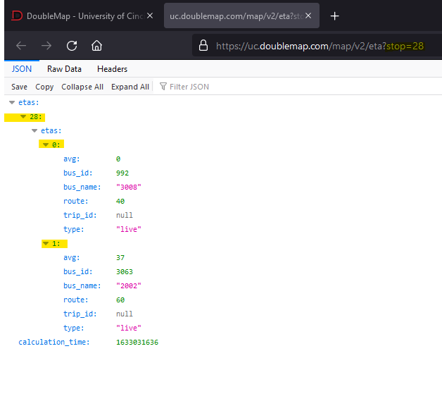
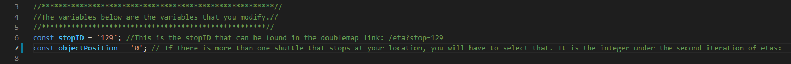

# NodeJS ShuttleStop Tracker
This project was a little bit more ambitious than I thought it was going to be, so I think I am going to expand on the web front for project 3, 
and allowing the information to be displayed in the index.html file, as well as allowing the user to submit the variables directly, 
rather than just manipulating the code themselves. I am planning on using the alert() function to expand much more on the functionality of the script.

I ran into a lot of problems with figuring out asynchronous functions. And because this is really my first time learning JavaScript, I had to do alot of Googling to figure things out, and currently looking for how to have the HTML scripts talk to NodeJS.

# What is it?
This is a NodeJS script that analyzes a specific UC shuttle stop and alerts you when its time to leave, when the bus is five minutes away, one minute away, and arriving. 
It runs a library called axios on the shuttle stops to grab the json data, and to look for the avg estimated time of arrival. 
It refreshes the data every 10 seconds. And when the if statement matches the one of the designated times, 
it outputs an additional message to remind you.

# How to use it?

Ensure you have NodeJS installed, download the project2.js, and open it in any text editor you like, preferably vscode if you have it.

First off, the program needs to know what shuttle stop you want to monitor. To do this navigate to [the University's shuttle map](https://uc.doublemap.com/map/), and turn on the route you want to use. Right click on either the header, or the right side panel, and select "inspect element". Or navigate to your browsers dev tools, and find that feature (F12 works for most browsers). Switch to the network tab to inspect file transfers, and click on your desired stop location to monitor. You should see a GET request made with the file `eta?stop=<yourStopID>`

Double click that link to view the physical json data, and take note of a couple of items that will be used in the script. First item to note, is your stopID, you can find that in the link eta?(stop=x). Or, you also will see in as the second object in the json data.
 

Second item to take note of, is the json object position. If your shuttle stop location serves more than one route, you will see all busses that stop there. So you need to figure out which ETA matches the one shown on the map, and note the position it is. In this screenshot, there are two buses: bus 0 and bus 1. Usually 0 is the correct choice.

  

In the project2.js file, go to line 6 where you will see the two variables: stopID and objectPosition. Change their values to the values you are using from the json file.
  
