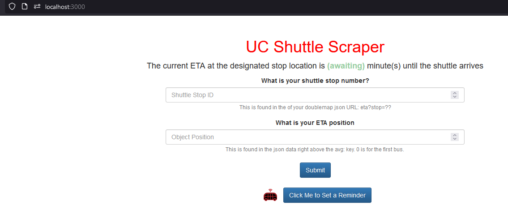
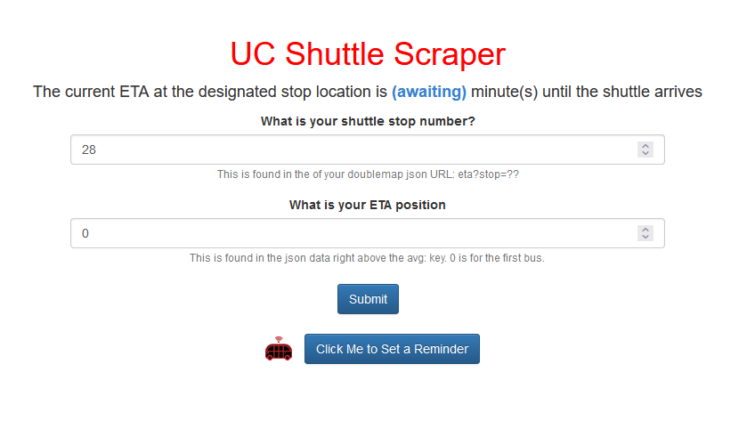

# NodeJS ShuttleStop Tracker
This project expanded on project 2 by applying client side HTML to fetch data from the nodeJS server, instead of you have to monitor the ETAs of the shuttles in the terminal window, you can now view them on localhost:3000. I also deployed it to [heroku](https://uc-shuttle-scraper.herokuapp.com/) for fun.

# What is it?
This is a NodeJS script that analyzes a specific UC shuttle stop and alerts you when its time to leave, when the bus is five minutes away, one minute away, and arriving. I also included a javascript button that can store a value that will alert you when the ETA is at or exceeded that value. NodeJS runs a library called axios on the shuttle stops to grab the json data, and to look for the avg estimated time of arrival. The client sends a fetch request to /get-eta to refresh the data every 10 seconds. And when the if statement matches the one of the aforementioned times, it outputs an alert to remind you.

# How to use it?

Ensure you have NodeJS installed, clone my repository by running `git clone https://github.com/uc-mestemax/it3038c-scripts.git`, and `cd it3038c-scripts`. You will also need to run `npm install axios` to allow for the scraping functionality. It's actually important to be right at the root of the /i3038c-scripts file path, because the script makes references to some relative paths that are contingent of you being in that spot. After you have installed axios, and ensured you are at the root of it3038c-scripts, run `node .\project3\flask\server.js` This will create a listening server on localhost:3000, so navigate a web browser to that spot. You should see something similar to this:

  

First off, the program needs to know what shuttle stop you want to monitor. To do this, navigate to [the University's shuttle map](https://uc.doublemap.com/map/), and turn on the route you want to use. Right click on either the header, or the right side panel, and select "inspect element". Or navigate to your browsers dev tools, and find that feature (F12 works for most browsers). Switch to the network tab to inspect file transfers, and click on your desired stop location to monitor. You should see a GET request made with the file `eta?stop=<yourStopID>`

Double click that link to view the physical json data, and take note of a couple of items that will be used in the script. First item to note, is your stopID, you can find that in the link eta?(stop=x). Or, you also will see it as the second object in the json data.
 

Second item to take note of, is the json object position. If your shuttle stop location serves more than one route, you will see all busses that stop there. So you need to figure out which ETA matches the one shown on the map, and note the position it is. In this screenshot, there are two buses: bus 0 and bus 1. 0 will always give you the first bus, so it's usually usuable.

  

On the localhost:3000 fill in the two input fields on the form with the stopID and objectPosition. Change their values to the values you are using from the json file. Click submit
  

Wait up to 10 seconds and pray that (awaiting) changes to a numeric value, and that's it!

Feel free to contact me on Teams if you need help running it!

## Final Remarks

I also did this in python using the flask module we were shown in class and it was so much easier that I wish I would of just committed to that. That file can also be ran in a virtual env environment, running `pip install requests`, and finally running `python .\project3\flas\web.py`

This project really told me what I didn't know and the breadth of many languages, so I am hoping to strengthen those skills as I move forward. I also did this with flask, and oh my gosh, it was so much more intuitive for me. Even though I spent the most time on the nodeJS portion for project three, NodeJS continues to keep me awake at night and give me nightmares, but nonetheless I learned a lot.

The big caveat or downfall of using heroku is that each time a form gets submitted, it overwrites the global variable of the form input that gets sent, which will change the parameters that the scraper depends on to fetch the ETA. So, essentially only one person can use it at a time, but I just wanted to throw it on heroku for the laughs, and in hindsight, this probably would of been better in just plain client side javascript fetching directly from the doublemap. Probably not the best idea to deploy a webscraper to heroku either I'd imagine.

Nonetheless, it was incredibly rewarding to accomplish this scraper in powershell, nodejs, and python (still gotta try it in bash). Deploying it in heroku was another improvement that allows me to use the scraper on my phone. This was a lot of fun!

Every time the ETA is refreshed you will notice it changes color. 